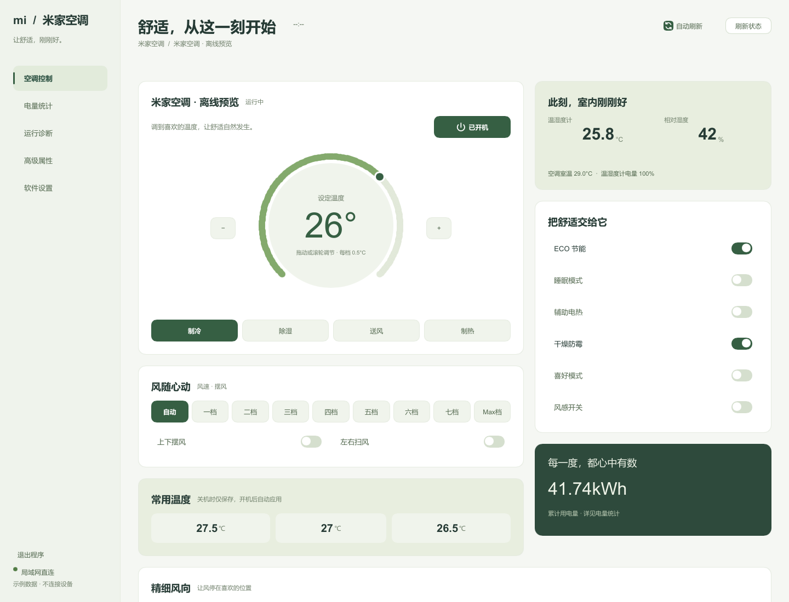

# 米家空调

一款面向 Windows 的米家空调桌面控制器。它用 Rust 和 Slint 构建，直接连接已授权的米家空调，让常用控制、电量数据、运行诊断和设备属性集中在一个轻量的原生客户端中。



## 为什么使用它

- **本地优先**：优先通过局域网 miIO 连接设备；局域网不可用时可切换云端 RPC。
- **日常操作集中**：开关机、模式、目标温度、风速、摆风和舒适功能都在一个界面完成。
- **看得见设备状态**：提供电量统计、温湿度、运行诊断和高级属性读写。
- **适合长期运行**：单实例、系统托盘、自动刷新，以及关闭时“收进托盘 / 直接退出”的可记忆选择。
- **原生且轻量**：不依赖 Electron、Chromium 或 Node.js；发布版启用体积优化与 LTO。
- **安全保存凭据**：新登录和旧凭据升级都使用当前 Windows 用户范围的 DPAPI 加密，保持自动连接。

## 下载与开始使用

从 [v2.2.0 发行版](https://github.com/zimo888u/mi-jia-kong-tiao/releases/tag/v2.2.0) 下载 Windows x86-64 便携版 `miac-app-v2.2.0-windows-x86_64.zip`，解压后运行 `miac-app.exe`。也可下载独立的 `miac-app.exe`。

首次启动时，点击“扫码登录米家账号”，使用米家 App 扫码并选择要控制的空调。程序会将凭据保存到当前 Windows 用户的米家空调数据目录。

## 功能概览

| 页面 | 能做什么 |
| --- | --- |
| 控制台 | 调节开关、模式、温度、风速、摆风和舒适功能 |
| 电量统计 | 查看日、月度用电信息 |
| 运行诊断 | 查看连接状态和设备运行信息 |
| 高级属性 | 读取或写入设备公开属性 |
| 软件设置 | 切换主题、传输通道、自动刷新和关闭行为，导出本次运行日志 |
| 对话控制 Skill | 可选安装包，让 Codex 查询室温与空调状态，并按型号安全校验控制操作 |

## 多型号适配

- 内置 46 个小米、智米、云米空调型号的公开 MIoT 规格：36 个正式版、10 个预览或调试版；其他型号首次使用时尝试在线获取并缓存。
- 按设备的真实型号识别，而不是按“1 匹 / 1.5 匹 / 2 匹”猜测协议。匹数相同并不代表属性地址相同。
- 自动显示米家账号中的设备名称；没有名称时显示型号。
- 开关、温度范围与步长、模式、风速及可用摆风/舒适功能随型号变化，不支持的可选控制隐藏。
- 原机型 `xiaomi.airc.h53h00` 保留专属控制与电量历史；其他型号不套用其历史耗电键和私有诊断属性。其他型号的实时电量如有读数，会注明单位未经确认。
- `xiaomi.aircondition.ma1`、`ma2`、`ma4` 的公开规格版本对模式数字定义互相冲突，未取得设备精确版本前不提供模式写入；开关和温度仍按规格使用。
- 在线识别的型号如存在多个同级规格版本，也会禁用未确认的模式写入。
- 46 个规格均通过离线解析测试，**不代表 46 款真机均已测试**。预览或调试规格尤其需要真机确认；能否控制仍取决于设备固件、账号授权及网络连接。非米家 MIoT 空调不保证兼容。
- 完整内置型号见 [兼容性说明](docs/compatibility.md)。规格离线解析通过不代表每款型号都经过真机测试。

## 从源码运行

需要 Rust stable 工具链和 Windows SDK（用于嵌入应用图标）。

```powershell
cargo run -p miac-app
```

启动登录弹层：

```powershell
cargo run -p miac-app -- --login
```

命令行诊断工具：

```powershell
cargo run -p miac-cli -- status
cargo run -p miac-cli -- creds
```

## 开发验证

```powershell
cargo test --workspace --locked
cargo run -p miac-app --example ui-preview -- docs/ui-preview
```

`ui-preview` 不连接设备、不读取凭据，会导出各页面的浅色与深色预览图并执行基础交互检查。

## 项目结构

```text
crates/miac-core/   miIO、云端 RPC、凭据、登录和设备控制核心
crates/miac-app/    Slint 桌面界面、Windows 托盘与应用图标
crates/miac-cli/    命令行诊断工具
docs/               UI 预览、验证资料与发行说明
```

## 兼容性与隐私

项目可读取旧版 Electron 客户端的 `device.json`、`cloud-session.json` 和 `thermometer.json`，启动时会将可读的旧凭据升级为加密格式。旧版客户端不能读取新格式；旧位置的明文副本不会擅自删除，设置页会提示检查。用户级 DPAPI 不能防止已经以同一 Windows 用户身份运行的恶意程序读取凭据，也不等于“绝对无法解密”。请勿将凭据、令牌或本地设备配置提交到仓库。

## 清理本机数据

双击 [清理米家空调数据.cmd](清理米家空调数据.cmd) 即可自动结束程序并清除当前用户的日志、缓存、设置和登录凭据。删除后需要重新扫码登录。

它会清空 `%APPDATA%\米家空调` 和 `%LOCALAPPDATA%\米家空调`，并删除项目目录及 `dist` 目录中兼容旧版便携包的凭据文件。

## 更新日志

完整记录见 [CHANGELOG.md](CHANGELOG.md)。
