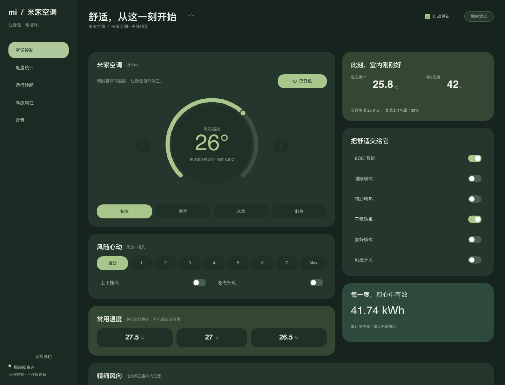

# 鼠尾草绿桌面 UI

依据 [Figma 设计稿](https://www.figma.com/design/ja25PFrxEaSMi0vTTixx7j?node-id=1-2) 更新五个原生 Slint 页面：空调控制、电量统计、运行诊断、高级属性、设置。

- 暖白 / 鼠尾草绿浅色主题，以及对应深色主题。
- 大尺寸温度转盘，保留拖动、滚轮、0.5°C 步进和 16–31°C 边界；增加加减按钮。
- 保留风速 0–8、四种模式、全部舒适开关、风感与定格、温度预设、日/月用电、诊断、属性读写和凭据设置。
- 页面仍按需实例化，保持软件渲染，无新增 UI 依赖。
- 新安装默认浅色；已保存或迁移的主题偏好不受影响。
- 修正原始属性输入值到主窗口的双向绑定，修复非 Windows 构建中无条件引用 Win32 托盘代码的问题。Windows 托盘代码路径保持原样。

## 启动真实应用

```sh
cargo run -p miac-app
```

真实应用使用原有设备连接、登录和配置逻辑，需要用户自己的设备凭据。

## 无设备预览与 UI 检查

```sh
# 打开交互式原生预览；不连接设备，不读取凭据，不写配置
cargo run -p miac-app --example ui-preview -- --interactive

# 导出五页浅色/深色截图、小窗口截图，并执行真实鼠标/键盘事件检查
cargo run -p miac-app --example ui-preview -- /tmp/miac-ui

# 核心回归与完整应用构建
cargo test --workspace --locked
cargo build -p miac-app --locked
```

预览数据只存在于 `examples/ui-preview.rs`，不会进入真实设备状态。交互预览用于布局及主要控件演示，不会执行属性写入、登录或凭据加密。

本次验证环境为 macOS Apple Silicon。真实空调控制、Windows 托盘和 Windows 内存指标需要在目标设备上复测。

## 实际软件渲染截图



